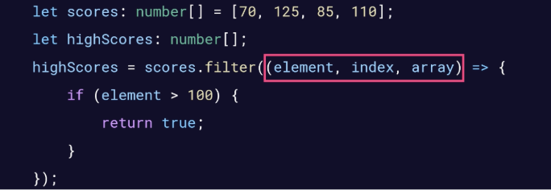
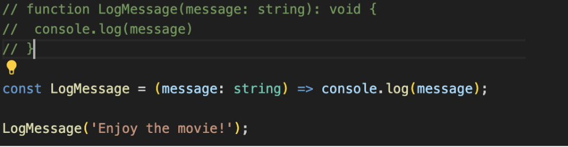
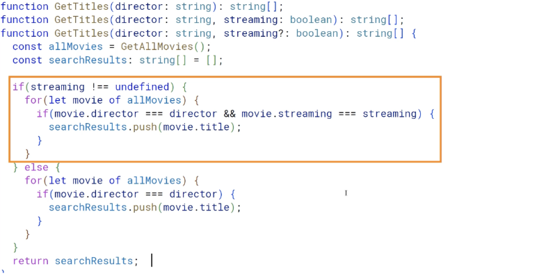
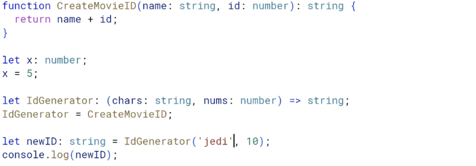

# 02 - Functions

## Function Annotations
- Example: function funFunc(score: number, message: string): string {}
	- Without the type annotations, will implicitly imply “any” type
		- –noImplicitAny makes it the opposite

## Optional, Default, Rest Parameters
- Example: function person(name: string = GetMostPopularBook(), age?: number) {}
	- Optional parameters denoted with ? after parameter name and must appear after all required parameters
	- Default parameters may be set to a literal value or expression
- Rest Parameters: Collects a group of parameters into a single array
	- Example: functionGetBooks(name:string, …bookIDs: number[])

## Arrow Function
- parameters => function body
	- Example 1: let squareit = x => x * x;
	- Example 2: let adder = (a, b) => a + b;
	- Example 3: let greeting = () => console.log(‘Hello World!’) Calling: greeting();
	- Example 4:
		

		- .filter(current element, index of element, original array)
		- Surrounded by {} because is multiple lines of code
		- Return keyword needed because it is multiple lines of code
- Typically used when you want to pass an anonymous function
- Example: Equivalent functions
	

## Function Overloads

- One signature (that represents all other functions with the same name as it) + multiple functions with the same name but different parameters

## Function Types
- Combination of parameter types and return type

	- IdGenerator shares the same type as CreateMovieID, allowing it to be called 

