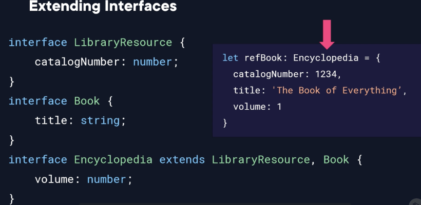
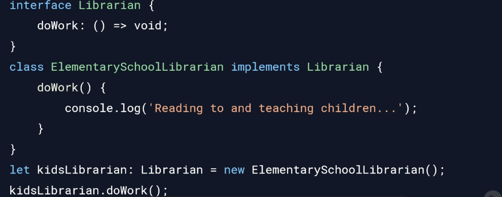

# 03 - Interfaces
## Declaring and Using Interfaces
- Used to define your own types that the Typescript compiler can check and make sure we’re using correctly
	- Can also be composed from other interfaces
- Interface Definition
	- A contract that defines a type that is checked by the compiler
	- Collection of property and method definitions
	- Duck typing: if an object has the shape of an expected type, then it can be used as if it were of that type, even if it wasn’t explicitly declared

	<pre>
```typescript

interface Duck {
	walk: () => void;
	swim: () => void;
	quack: () => void;
}

let probablyADuck = {
	walk: () => console.log(`walking`);
	swim: () => console.log(`swimming`);
	quack: () => console.log(`quacking`);
}

function FlyOverwater(bird: Duck) { }
FlyOverWater(probablyADuck);

```
</pre>

- Define an interface:
	- “Interface” keyword
	- List properties with their type
	- Optional properties denoted with “?”
	- Provide function signatures — no implementation

# Extending Interfaces


# Class Types

