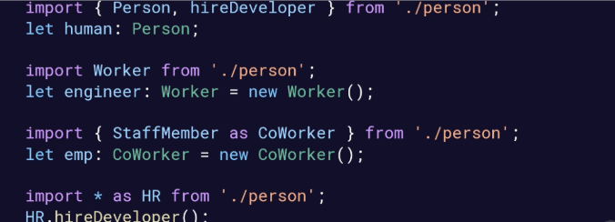

# Modules
## Importance of Modules
- Encapsulation, Reusability, Creator higher-level abstractions
- Typescript Compiler → Javascript Modules → Node

## Exporting/Importing a Declaration
- // person.ts
	- Example 1: export interface Person { }
	- Example 2: export function hireDeveloper(): void { }
	- Example 3: export default class Employee { }
	- Example 4: export { Person, hireDeveloper, Employee as StaffMember }
- Export Statements 
	- export {interfaceName, functionName, className as aliasName}
	- Or put "export" in front of individual class/function/interface declarations
- Importing from a Module Example
	- 

## Relative vs. Non-Relative Imports

- Relative: Used for personal modules
- Non-Relative: Used for third-party modules

## Module Resolution Strategies
- tsc –moduleResolution Classic | Node
