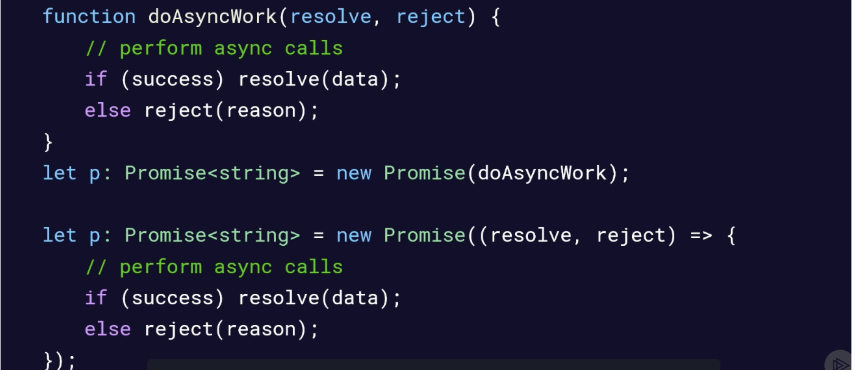
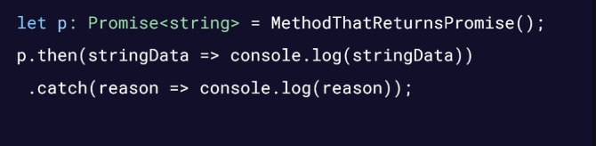

# Asynchronous Code
## Why Synchronous Code Matters
- Synchronous Execution: task by task finishing basis
- Asynchronous Execution: Single thread of execution could still continue to do work while waiting for another task

## Promise
- The promise object represents the eventual completion (or failure) of an asynchronous operation and its resulting value
- Small API: then, catch
- May be chained together
- Created by passing a function to the Promise constructor

## Creating a Promise
- The angle brackets <> for a promise is the type that will be returned if the Promise is resolved successfully
	
- Handling Promise Results
	
- async/await
