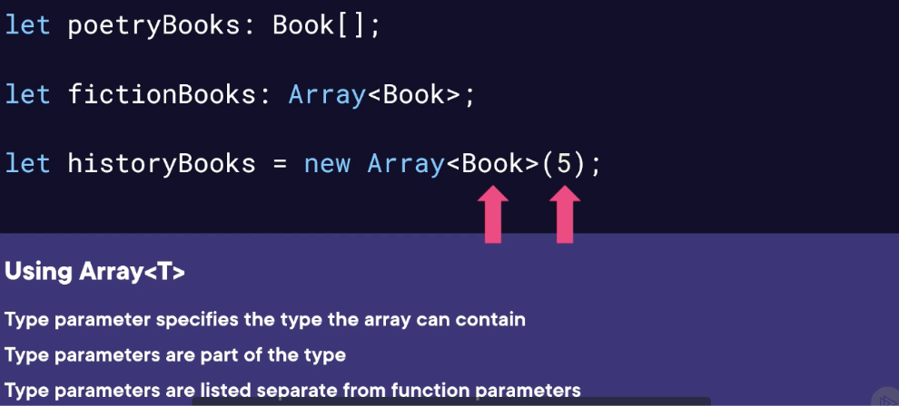

# Generics
- Generics Definition
	- Code that works with multiple types
	- Accept “type parameters” for each instance or invocation 
	- Apply to functions, interfaces, and classes
- Type Parameters
	- Specify the type a generic will operate over
	- Listed separate from function parameters inside angle brackets
	- Conventionally represented by the letter ‘T’
	- Actual type provided at instance creation or function invocation

- Using Generics

- Generic Constraints
	- Describe types that may be passed as a generic parameter
	- “Extends” keywords applies constraints
	- Only types satisfying the constraint may be used
